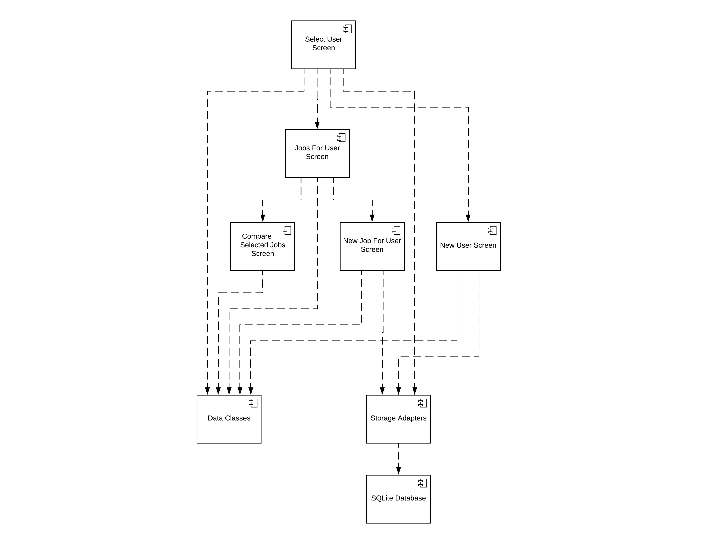
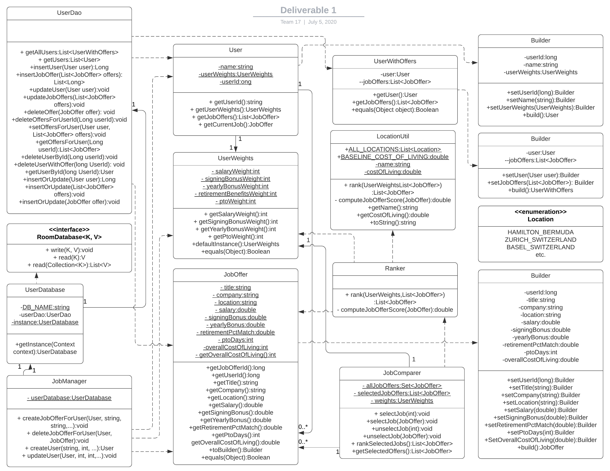
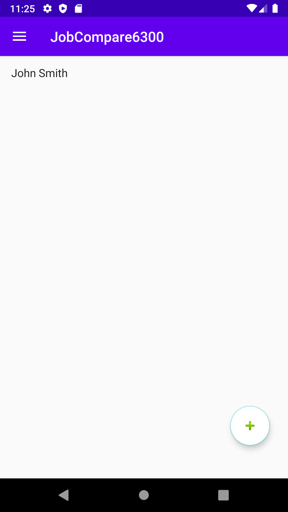
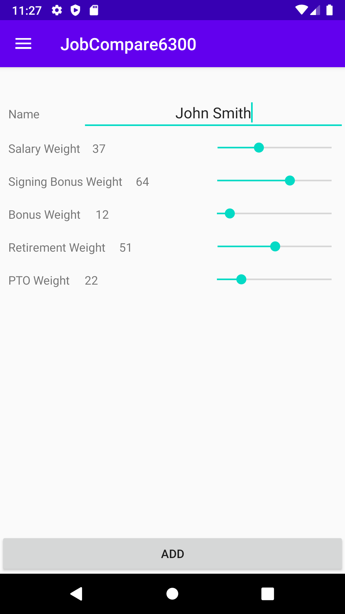
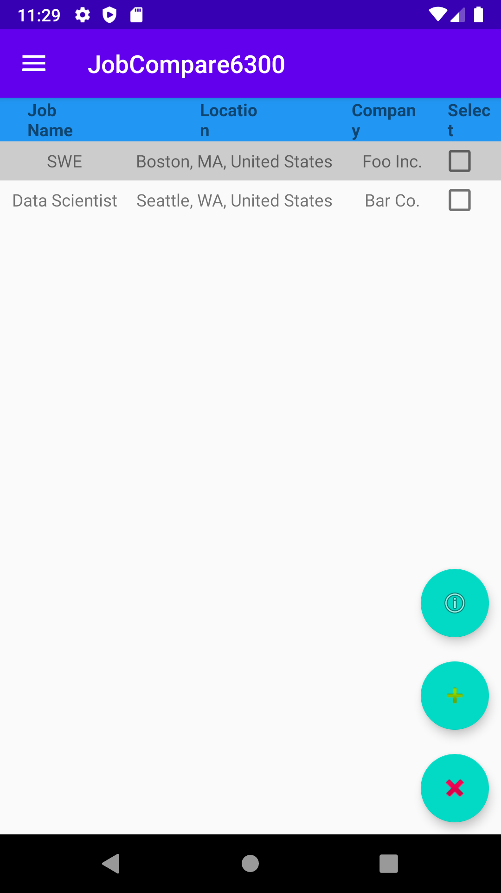
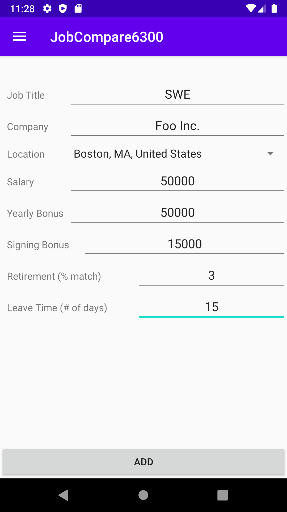
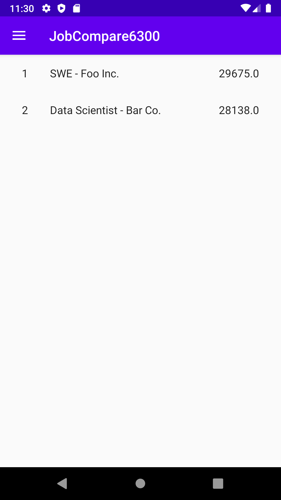

# Design Document

**Author**: Team 17

## 1 Design Considerations

### 1.1 Assumptions

* User has an Android device supporting API level 28 (Android 9 [Pie]) and above.
* There is only ever one user for the application on any particular device.
* Libraries for internal functionality such as SQLite are available.

### 1.2 Constraints

* Android application needs to use a data storage layer to persist information across multiple uses of the application. SQLite will be used as the storage layer which needs to be abstracted away from the calling code.
* User needs to have access to an Android smartphone.
* User should have basic information about their job and any pending job offers.

### 1.3 System Environment

* A modern Android device with API level 28 and above.
* The device should have a diagonal screen size of 4.5" or greater.

## 2 Architectural Design

### 2.1 Component Diagram

### 2.2 Deployment Diagram

All code and modules will live on a single Android device, including all applicable libraries. As such, a separate deployment diagram is unnecessary as there is only ever one item to deploy, the single application itself.

## 3 Low-Level Design

### 3.1 Class Diagram

## 4 User Interface Design

### Select user screen

### Add user screen

### All jobs -- overview

### Add job

### Compare jobs

