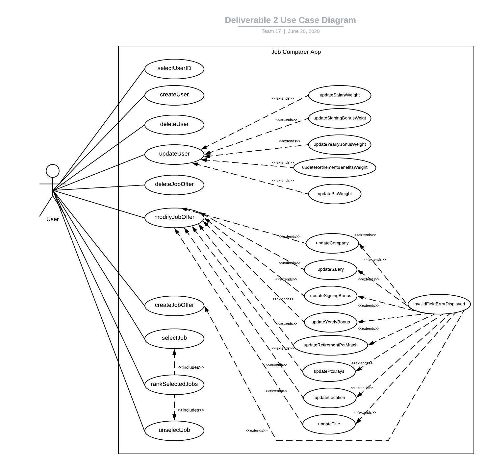

# Use Case Model

**Author**: Team17

## 1. Use Case Diagram

## 2. Use Case Descriptions

Use Case: selectUser
- Requirements: The user must be able to select a user ID from a dropdown menu.
- Pre-conditions: The user must have previously created a user
- Post-conditions: The user must then have the ability to update the selected user's weights, and perform all other functions on the app.
- Scenarios:
>- Normal: The user successfully selects a user Id from the dropdown menu.
## 
##

Use Case: createUser
- Requirements: The user must be able to create user, with a user id and user weights.
- Pre-conditions: None (this is one of the first thing the user can do).
- Post-conditions: A user will be created and the user ID will be displayed. The user can then modifyUser if necessary, create job offers, and perform all other functions on the app.
- Scenarios:
>- Normal: The user correctly adds valid weights for all user weight input fields using the sliding scale. The user is successfully created.
	
##
##
Use Case: updateUser
- Requirements: The user must be able to update any of the user weights. This includes updating salary weight, updating signing bonus weight, updating yearly bonus weight, update retirement benefits weight, and update pto weight.
- Pre-conditions: The user must have created a user and selected a user. The user must enter a new weight in the field that they want to update.
- Post-conditions: The user will be updated with the new weight(s).
- Scenarios
>- Normal: The user updates a weight or multiple weights to valid value(s) using the sliding scale(s). The user is succesfully updated.
	
##
##

Use Case: createJobOffer
- Requirements: The user must be able to create a job, with a job title, company, loacation, salary, signing bonus, yearly bonus, retirement percent match, pto days, and cost of living.
- Pre-conditions: The user must have created and selected a user.
- Post-conditions: The job will be created. The job can now be selected.
- Scenarios:
-- Normal: The user correctly adds valid values for all of the job input fields. The job is successfully created.
-- Exception: The user enters an incorrect value for one or more of the job input fields. The job is not successfully created and an error message is displayed.
	
##
##

Use Case: deleteJobOffer
- Requirements: The user must be able to delete job offers.
- Pre-conditions: The user must have created the job offer.
- Post-conditions: The job offer is deleted, it dissappears from the ui, and it can no longer be selected.
- Scenarios:
>- Normal: The job offer is successfully deleted.
	
##
##

Use Case: modifyJobOffer
- Requirements: The user must be able to update any of the attributes of a job offer. This includes job title, company, location, salary, signing bonus, yearly bonus, retirement percent match, pto days, and cost of living.
- Pre-conditions: The user must have created the job offer.
- Post-conditions: The job offer is successfully modified, and the new values appear when the job is selected.
- Scenarios:
>- Normal: The user enters valid value(s) for the modified job offer field(s). The job offer is successfully modified.
>- Exception: The user enters an invalid value for one or more of the job input fields. The job offer is not successfully modified and an error message appears.
		
##
##

Use Case: selectJob
- Requirements: The user must be able to select one or more job offers.
- Pre-conditions: The user must have created one or more job offers.
- Post-conditions: The job offer(s) must be shown as selected.
- Scenarios:
>- Normal: The user clicks on the job offer and the job offer is selected.

##
##

Use Case: unselectJob
- Requirements: The user must be able to unselect one or more of the job offers.
- Pre-conditions: The user must have created one or more job offers and must have selected one or more job offers.
- Post-conditions: The job offer(s) must no longer be selected.
- Scenarios:
>- Normal: The user click on a selected job offer and the job offer is no longer selected.

##
##

Use Case: rankSelectedJobs
- Requirements: The user must be able to rank all of the selected jobs based on user weights.
- Pre-conditions: The user must have created a user, selected a user id, created at least two job offers, and selected at least two job offers.
- Post-conditions: The user will be shown the job offers as an accurately ranked list.
- Scenarios:
>- Normal: The user selects at least two job offers. The user will then be presented with the option to rank the selected jobs. The application ranks the jobs and displays the ranked list to the user.