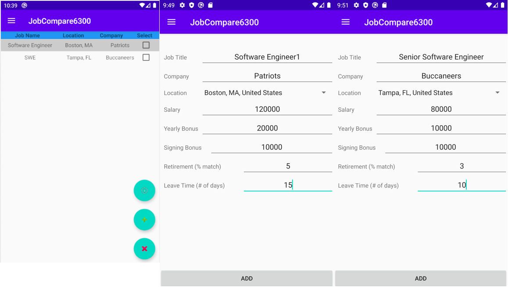

# User Manual

**Author**: Team 17

| Version | Description |
|---------------|----------------|
| V2 | Final User Manual |

This Android app is intended to be used by job seeker to compare job offers. This app has the ability to store user information with weights and job offer information including title, company, location, salary, signing bonus, yearly bonus, retirement benefit and leave time. 

## Overview of App

This app is a simple user interface that allows the user to easily add user, user weights, job offers and compare job offers.  

The minimum API level for the app should be “API 28: Android 9.0 (Pie)”.

## Steps

### Add User w Weights

The app has the ability to add multiple users to compare their own job offers. After opening the app, the main menu is shown as following.

* Click `+` button at bottom right and enter the `User and User Weight` menu.

* In `User and User Weight` menu, entry the user name and choose the weights using slide bar. Click "ADD" button to finish.

### Select User

* Select the user by clicking on the user name and then click the top left. The selected user name is shown on the top.

### Select Jobs
 * Click `Select Jobs` and enter `Add Jobs` menu.
 

 
 * In `Add Jobs` menu, click `+` button to add jobs. To delete job, select the job needs to be deleted and click `X`. To update the job offer, user needs to delete the job offer first and then add a new job offer again.
 

 * Enter Job Title, Company, Salary, Signing Bonus, Yearly Bonus, Retirement (% match) and Leave Time (# of days) and choose Location from drop down. Then click `ADD` button to finish.
 

 

### Compare Jobs

 * Select the jobs and click `Job Comparer` button on the bottom right. 
 

 * The ranked jobs with title, company and scores will be shown as following.
 

## Troubleshooting

* If an empty entry in `Name` field, an error message of "_Please enter a username_" is shown at the right of box.

* If an empty entry in `Job Title` field, an error message of "_Please enter a Job Title_" is shown at the right of box.

* If an empty entry in `Company` field, an error message of "_Please enter a Company_" is shown at the right of box.

* If an empty entry in `Salary` field, app will use 0 for salary.

* If an empty entry in `Signing Bonus` field, app will use 0 for signing bonus.

* If an empty entry in `Yearly Bonus` field, app will use 0 for yearly bonus.

* If an empty entry in `Retirement (% match)` field, app will use 0 for retirement benefit. 

* If an empty entry in `Leave Time (# of days)` field, app will use 0 for leave time. 

 

